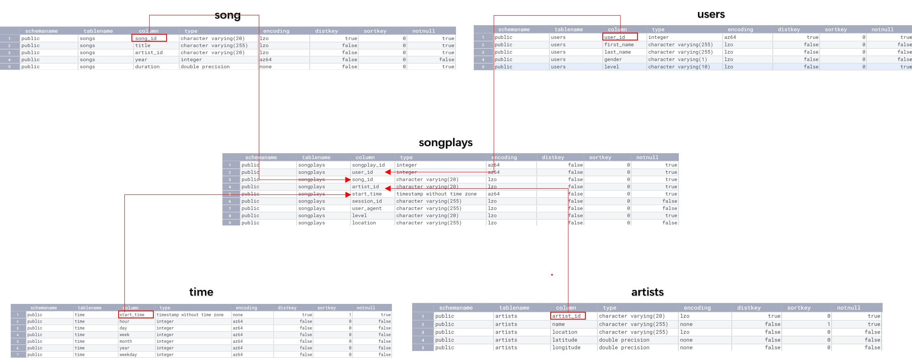
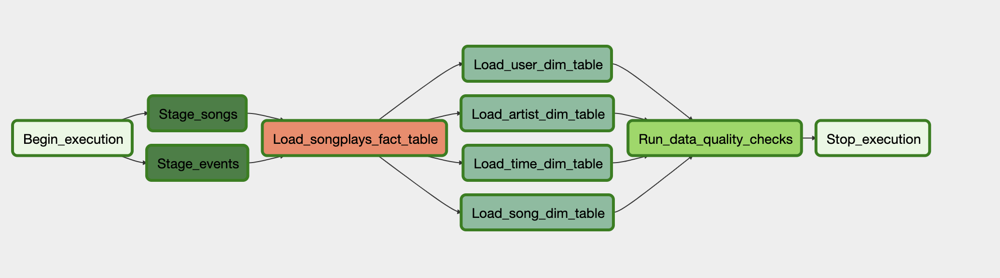
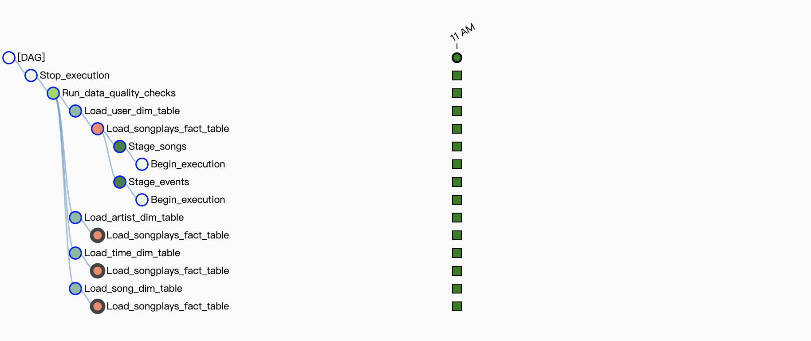

# Data Pipelines with Airflow

Build an Data warehouse on AWS Reshift with using Data Pipelines Airflow.

### Table of Contents

1. [Project Motivation](#motivation)
2. [File Descriptions](#files)
3. [Run](#results)
4. [Licensing, Authors, and Acknowledgements](#licensing)

## Project Motivation<a name="motivation"></a>
A music streaming company, Sparkify, has decided that it is time to introduce more automation and monitoring to their data warehouse ETL pipelines and come to the conclusion that the best tool to achieve this is Apache Airflow.

Creating high grade data pipelines that are dynamic and built from reusable tasks, can be monitored, and allow easy backfills. The data quality plays a big part when analyses are executed on top the data warehouse.

The source data resides in S3 and needs to be processed in Sparkify's data warehouse in Amazon Redshift. The source datasets consist of JSON logs that tell about user activity in the application and JSON metadata about the songs the users listen to.

### Fact table and Dimension table with star schemas


### The task dependencies 


### The Dags tree view


## File Descriptions <a name="files"></a>

```
- dags
    |- data_warehouse_ETL_dag.py  # Create Dag and tasks  
- plugins  
    |- helpers
          |-__init__.py
          |-sql_queries.py  # Create tables and insert data from staging table to fact and dim tables
    |- operators
          |-__init__.py
          |-data_quality.py  # Data quality check, the fact and dim tables are not empty
          |-load_dimension.py  # Load data into dim tables
          |-load_fact.py # load data into fact table
          |-stage_redshift.py # create staging tables and copy data from s3 to redshift
- README.md
```

## Run <a name="results"></a>

https://airflow.apache.org/docs/apache-airflow/stable/start/docker.html

```
docker-compose up
```

## Licensing, Authors, and Acknowledgements <a name="licensing"></a>

### Built With
* [airflow](https://airflow.apache.org/) - Airflow is a platform created by the community to programmatically author, schedule and monitor workflows.

### Versioning

* We use [SemVer](http://semver.org/) for versioning. For the versions available, see the [tags on this repository](https://github.com/your/project/tags).

### Authors

* **Tom Ge** - *Data egineer* - [github profile](https://github.com/tomgtqq)

### License

* This project is licensed under the MIT License
